<div align="center">

<sub><sub>`// ARCHITECTURE OF SELF-AUDITING COGNITION`</sub></sub>

# Kevin Kull &nbsp;·&nbsp; *Kuonirad*



<br/>

**Creator of [M-COP 2.0](https://github.com/Kuonirad/MCOP-Framework-2.0) — self-auditing AI cognition.**
Building AI systems whose reasoning is *traceable*, whose energy is *conserved*,
and whose causality is *respected*.

<sub>`cognition · projected · live`</sub>

<br/>

[](https://kuonirad.github.io)
[](https://github.com/sponsors/Kuonirad)

</div>

---

### `§ 02 · thesis`

<div align="center">



</div>

> The next generation of AI will not be judged by what it *generates* — but by what it can ***justify***.
> The frame I work inside is built on three commitments: cognition that is ***auditable***, work that is ***conserved***, and structure that is ***respected***. Reasoning leaves a trace. Energy budgets close. Causal graphs preserve direction.

<table>
<tr><td>discipline</td><td><i>Architecture &amp; theory</i></td></tr>
<tr><td>tools</td><td><i>TypeScript · Python · Rust · CUDA · formal methods</i></td></tr>
<tr><td>method</td><td><i>Build it; prove it; then trust it.</i></td></tr>
<tr><td>currently</td><td><code>M-COP 2.0 → public reference impl</code></td></tr>
</table>

---

### `§ 03 · work`

<table>
<tr>
<td valign="top" width="33%">

 

#### *M-COP* Framework 2.0
<sub>`github.com/Kuonirad/MCOP-Framework-2.0`</sub>

A reference implementation of the Meta-Cognitive Operating Protocol — self-auditing reasoning loops with conserved-energy budgets and DAG-preserving causality.

 

[**Open repo →**](https://github.com/Kuonirad/MCOP-Framework-2.0)

</td>
<td valign="top" width="33%">


#### thermo-truth *proto*
<sub>`github.com/Kuonirad/thermo-truth-proto`</sub>

Prototype: probabilistic truth assignment via thermodynamic free-energy minimization. Treats inference as a system relaxing toward equilibrium.

 

[**Open repo →**](https://github.com/Kuonirad/thermo-truth-proto)

</td>
<td valign="top" width="33%">


#### Sensory-Tracer *Science*
<sub>`github.com/Kuonirad/Sensory-Tracer-Science`</sub>

Proposal for a new subfield: tracing perceptual signals through reasoning stacks the way isotopes trace metabolism. End-to-end attribution as a primitive.

 

[**Open repo →**](https://github.com/Kuonirad/Sensory-Tracer-Science-STS-Proposal-for-a-New-Subfield)

</td>
</tr>
</table>

---

### `§ 04 · lab`

> #### The cognition *logs itself.*
> Every step the system takes is appended to an append-only ledger — timestamped, signed, replayable. The trace below is a captured snapshot of an audit stream from a live M-COP run.

```text
14:02:11  audit::   trace.step #04812 — energy ok          [ok]
14:02:11  cognit::  reflective_loop("plan_v3") :: depth 4
14:02:12  thermo::  ΔS = +0.0012 nats · within budget
14:02:12  causal::  preserved · DAG #2 integrity 1.000     [ok]
14:02:13  meta::    self_critique → revise(plan_v3) ↻
14:02:14  audit::   trace.step #04813 — drift +0.004
14:02:14  glitch::  ≋ phase slip · resynced ≋              [glitch]
14:02:15  sensor::  tracer · 7 channels nominal
14:02:16  audit::   trace.step #04814 — PASS               [ok]
14:02:17  sign::    commit 0x4B4B…F7E1 written
```

#### `/ dr. audit` &nbsp;—&nbsp; *the same dynamic, visualized · and playable*

<div align="center">

<a href="https://kuonirad.github.io/dr-audit/"></a>

[](https://kuonirad.github.io/dr-audit/)

</div>

A Dr. Mario offshoot. **Drift viruses** (plasma) accumulate in the bottle when reasoning leaves residue. **Audit capsules** (solar / cyan / sage) fall from above; aligning four-in-a-row of one color removes the run — same loop as the trace above, rendered as a containment game.

The SVG above is a deterministic precomputed playthrough (pre-baked SMIL, no JS, ~48 s cycle). For the **real playable version** — keyboard, touch, rotations, levels, chain reactions — open **[kuonirad.github.io/dr-audit](https://kuonirad.github.io/dr-audit/)**.

<details>
<summary><code>/ ledger · trajectory</code></summary>

| year | event | tag |
| ---: | :--- | :--- |
| 2021 | *first formal write-up of the meta-cognitive frame* | `seed` |
| 2023 | *thermo-truth proto — closed-form energy budget* | `prototype` |
| 2024 | *Sensory-Tracer Science — proposal published* | `subfield` |
| 2025 | *M-COP Framework 1.0 — internal reference impl* | `v1` |
| 2026 | *M-COP 2.0 — public, auditable, production-ready* | `v2 · current` |

</details>

---

<div align="center">

### Send a *signal.*

If any of this resonates — collaborations, audits, deep dives, fellowships — channel is open.

[](https://github.com/Kuonirad)
[](https://x.com/kevinkull)
[](https://www.linkedin.com/in/kevinkull-92)
[](https://github.com/sponsors/Kuonirad)

<sub><sub>`// channel · open` &nbsp;&nbsp;·&nbsp;&nbsp; `// sig · 0x4B4B`</sub></sub>

<br/>

<sub>`K. Kull / Kuonirad`&nbsp;·&nbsp;`index ▸ 001`&nbsp;·&nbsp;`cyberpunk + atompunk + solarpunk`</sub>

<sub>This README is the front door. The full designed homepage — rotating tesseract, glass nav, live audit terminal, glitch hover — lives at **[kuonirad.github.io](https://kuonirad.github.io)** ↗</sub>

</div>

